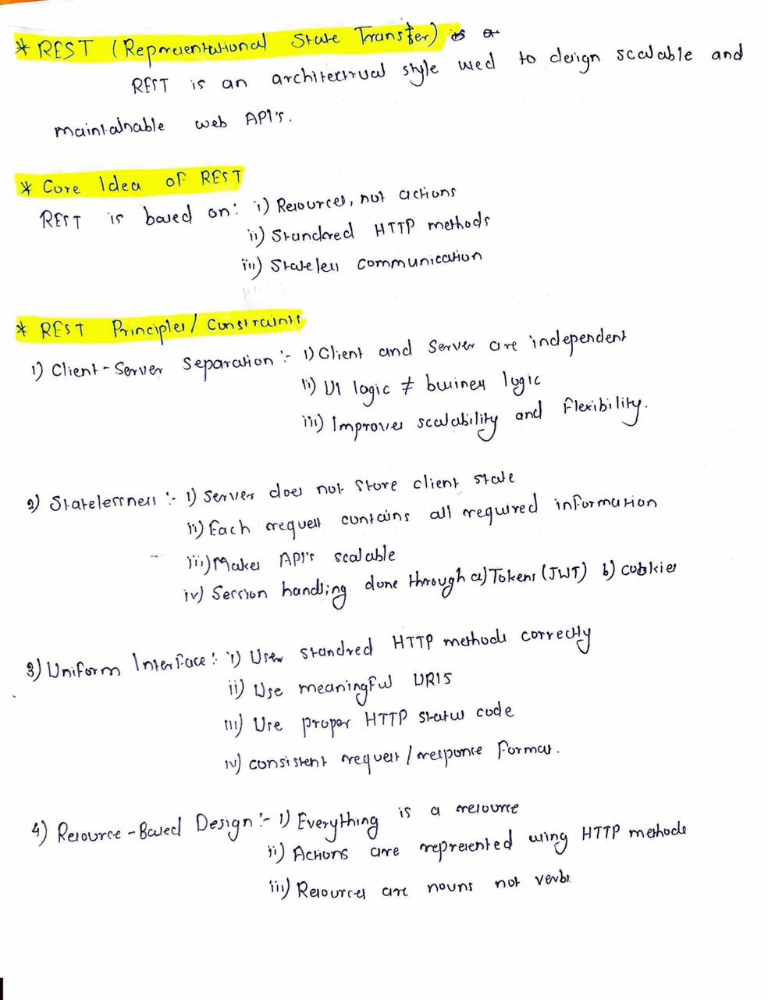
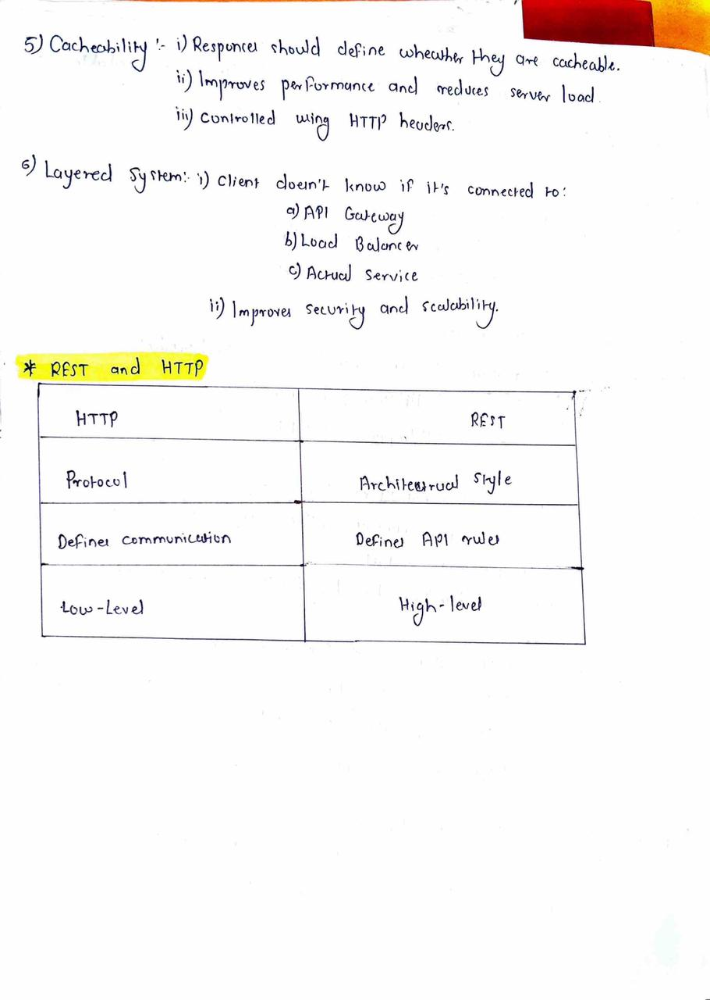

---
# REST Principles

This document explains the **core principles of REST (Representational State Transfer)**.
REST is used as a guideline for designing web APIs that are simple, scalable, and maintainable.

The content is written as **study notes**, not interview questions or answers.

---

## What is REST?

REST (Representational State Transfer) is an **architectural style** used for designing APIs.
It defines a set of constraints that describe how resources should be identified and interacted with.

REST is **not** a protocol, framework, or technology.
It provides design principles rather than implementation details.

---

## Core REST Principles

### 1. Client–Server Separation

The client and server are separated and operate independently.

- The client handles the user interface
- The server handles business logic and data
- Changes on one side do not directly affect the other

This separation improves maintainability and scalability.

---

### 2. Statelessness

REST APIs are stateless.

- The server does not store client state
- Each request contains all the information needed to process it
- Requests are independent of each other

State, if required, is managed on the client side using tokens or identifiers.

Statelessness allows easy horizontal scaling of services.

---

### 3. Resource-Based Design

In REST, everything is treated as a **resource**.

- Resources represent data or entities
- Each resource is identified using a unique URI
- Resources are usually nouns, not actions

Examples:

/users
/users/1
/orders/10

Operations on resources are performed using standard methods instead of action-based URLs.

---

### 4. Uniform Interface

REST APIs follow a uniform and consistent interface.

This includes:
- Consistent URI structure
- Standard operations for all resources
- Predictable request and response formats

A uniform interface makes APIs easier to understand, use, and maintain.

---

### 5. Cacheability

REST responses can be marked as cacheable or non-cacheable.

- Caching improves performance
- Reduces server load
- Helps in faster client responses

Cache behavior is defined as part of the response metadata.

---

### 6. Layered System

REST supports a layered architecture.

- Clients do not know whether they are connected directly to the server
- Intermediate layers such as gateways or proxies may exist
- Improves security, scalability, and flexibility

---

## Summary

- REST is an architectural style for API design
- It is based on constraints, not implementation
- Stateless communication and resource-based design are central ideas
- REST encourages consistency, scalability, and simplicity

REST principles act as a **blueprint for designing APIs**, while leaving implementation choices open.

---
## Handwritten Notes Reference

